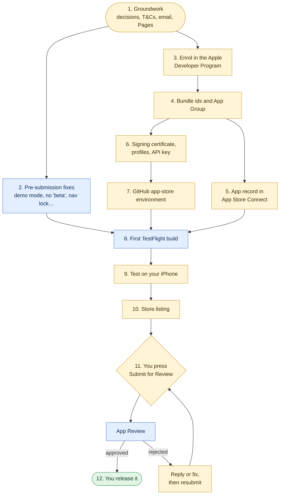

# Getting Voucherboard onto the App Store

The steps from where the iOS app is now (it builds in CI and runs in the Simulator) to live on the App Store. Every step
says who does it:

| Tag | Who | Means |
| --- | --- | --- |
| **YOU** | Marius | Only the account holder can do it: identity, money, legal declarations, signing keys, pressing Submit |
| **CLAUDE** | A coding session | Code or document changes in this repo, on request |
| **CI** | GitHub Actions | Runs by itself, or when you start it |
| **APPLE** | Apple | Waiting time you can't speed up |

Facts about Apple's rules were read on 8 October 2026 from the pages linked. Apple changes them, so check a linked page
when a step depends on it.



Yellow is yours, blue is Claude, CI or Apple, green is the end.

## Already done

- The app builds on every change in CI (`.github/workflows/ios.yml`, Xcode 26.6 on GitHub's macOS 26 runner), and the
  build is checked for the engine, council scripts and both extensions.
- An owner-only, approval-gated workflow signs and uploads to TestFlight. It never submits for review (step 8).
- Store listing text, review notes, a brief for App Review, privacy and age-rating answers, a screenshot plan and a
  letter asking the council for permission are in `voucherboard/mobile/ios/AppStore/` (see its `README.md`).
- `PRIVACY.md` covers the iPhone app. `SUPPORT.md` gives voucherboard@mariusrubin.com. Both are rendered to `docs/` for
  GitHub Pages, and CI checks they're up to date.
- `test/appstore.test.js` checks the listing against App Store Connect's limits, and that it never says "beta".

## Cost and time

- **Money:** the Apple Developer Program, 99 USD a year, charged in pounds at Apple's local price when you enrol
  (https://developer.apple.com/programs/enroll/). It auto-renews. There's no fee waiver for individuals. GitHub's macOS
  runners are free for this public repo. Nothing else costs money.
- **Your time:** about a day of your own work in total, spread over a week or two, mostly steps 1, 6, 9 and 10.
- **Apple's time:** enrolment is usually a day or two after identity checks. App Review is often a day or two, longer if
  they ask questions.

---

## 1. Groundwork

### 1.1 Enrol as an individual **YOU**

Enrol as an individual, not an organisation.

- No D-U-N-S number or company needed. "If you're a sole proprietor/single-person business, you must join as an
  individual" (https://developer.apple.com/help/account/membership/program-enrollment/).
- **Your legal name is shown as the seller** on the App Store: "Your name will be displayed as the seller name of your
  apps on the App Store."
- If you later set up a company to sell Voucherboard, the app can be moved to the company's account with Apple's app
  transfer, without users losing it.

### 1.2 Check your employment contract **YOU**

The brief tells Apple the app is your own original work. If your employment contract claims inventions or software
made outside work, get your employer's written confirmation that Voucherboard is yours. It's quick now and costly later,
especially if you sell it.

### 1.3 Decide where to offer it **YOU**

Recommendation: **United Kingdom only**, and declare **not a trader** for the EU.

- The app only works for Lewisham permits, so other countries add nothing but obligations.
- Apple requires every account to declare a Digital Services Act status, even with no EU distribution. If you don't
  distribute on the App Store in the EU, "you're not acting as a trader on the App Store", and you don't publish an
  address or phone number
  (https://developer.apple.com/help/app-store-connect/manage-compliance-information/manage-european-union-digital-services-act-trader-requirements/).
- If you later charge for it, revisit this: commercial distribution in the EU means trader status, with your address
  and phone number on the product page.

### 1.4 Read and save the permit site's own terms **YOU**

The research for the brief could read every public document (`AppStore/REVIEW_BRIEF.md`, section 7) but not the terms
the permit site shows after signing in. They're the one place a restriction could be.

1. Sign in at https://parkingpermits.lewisham.gov.uk.
2. On each permit, open **Terms and Conditions** (the link on the permit's card). Also read any terms shown in the
   Buy Again flow, up to (not including) payment.
3. Print each to PDF, with the date in the file name. Keep them outside the repo.
4. Search them for: app, application, software, automated, robot, script, third party, agent, behalf, share, password.
5. Replace the first `[OWNER: …]` note in `REVIEW_BRIEF.md` section 7 with what you found.

If they **do** restrict third-party software, stop here and tell Claude: the submission plan changes, and so may the
Chrome extension.

### 1.5 Ask the council and NSL for written permission **YOU** (recommended)

Apple guideline 5.2.2: "ensure that you are specifically permitted to do so under the service's terms of use.
Authorization must be provided upon request." The published terms are silent: nothing forbids Voucherboard, and
nothing specifically permits it. That's the biggest risk to approval.

- **Recommendation: send `AppStore/permission-request.md`** to the council's parking service and to NSL, a week or two
  before submitting. A written "yes", or even a reply raising no objection, answers 5.2.2 completely if App Review asks.
- **The risk:** a "no" would also put the Chrome extension in question. Without asking, you can still submit and rely on
  the published terms being silent, and many apps are approved that way. But if App Review asks, you'll have nothing
  more to give them.
- Either way, fill in the second `[OWNER: …]` note in the brief with what you did, then remove all the notes.

### 1.6 Set up the support mailbox **YOU**

Create voucherboard@mariusrubin.com, and check it's monitored. App Review may email it, and it's on the support page.

### 1.7 Turn on GitHub Pages **YOU**

Repository **Settings > Pages > Build and deployment > Deploy from a branch**: branch `feat/ios-app`, folder `/docs`,
Save. Once `feat/ios-app` is merged, change the branch to `main`. Check these open without signing in:

- https://voucherboard.mariusrubin.com/voucherboard/privacy.html
- https://voucherboard.mariusrubin.com/voucherboard/support.html

---

## 2. Fixes before the first submission **DONE** (CLAUDE, 8 Oct 2026)

Fixes (a) to (g) are on `feat/ios-app`, with tests; the iOS build check compiles them. Check them on your phone in step 9.

| # | Fix | Why |
| --- | --- | --- |
| a | **Demo mode.** "Try the demo" on the sign-in screen runs the whole app against a made-up council site in memory (`mobile/www/demo.js`): one permit in zone B1, three favourites, a visitor parked now, bookings around today, and unused 1-hour, 5-hour and day vouchers. Booking, cancelling, ending early and favourites all work. Buy and Show council site explain what they'd do instead. Your own plans and settings are never touched, and nothing is sent anywhere. A DEMO tag shows on Today; **More > Leave the demo** (or Sign out) ends it. Also used for the screenshots. | 2.1(a): review needs a demo account "or a built-in demo mode … with prior approval by Apple". A real council account can't be shared. |
| b | **No "beta" in the app.** The More footer, the "Experimental: end bookings early" toggle, "End early (experimental)", and the terms (now version 2026-10-08, so everyone accepts again): section 3 is "A product still being developed", section 4 drops the built-in end date, section 8 offers best-effort email support, section 12 links the privacy policy. **The terms are shared with the extension: read them and say if you want any wording changed.** | 2.2: "Demos, betas, and trial versions of your app don't belong on the App Store". 1.5: an easy way to contact you. |
| c | **Share extension no longer opens the app** through the Objective-C runtime. It says "Plate text read. Open Voucherboard within 10 minutes to choose the plate." | 2.5.1: public APIs only. |
| d | **Council view locked.** Links you tap that leave the council site, and the council's account registration, open in Safari. Payment and 3-D Secure redirects still load in the app. | Age rating 4+ (no "Unrestricted Web Access"). 5.1.1(v): no account creation in the app. |
| e | **Privacy policy and support links** in More, and a privacy link under the terms. | 5.1.1(i), 1.5. |
| f | **Notification permission** is asked after the first booking, when reminders are on, so default-on reminders arrive. | Reviewers check features work. |
| g | **iPhone only** (`TARGETED_DEVICE_FAMILY: "1"`). Add iPad in an update. | iPad layout unchecked; iPad would need its own screenshots and review. |
| h | **Bank holidays after 2027** in `src/zones.js`. Still to do; not a review issue. | |


---

## 3. Join the Apple Developer Program **YOU** (about 20 minutes, then a day or two of waiting)

Source for 3.2 and 3.3: https://developer.apple.com/help/account/membership/enrolling-in-the-app/

### 3.1 Before you start

- **Which Apple Account.** Your personal one is fine, or a new one just for this. Whichever you pick becomes the
  **Account Holder** of the team for as long as the app exists, and it's the one you sign in to App Store Connect with.
  A new account keeps Voucherboard's email, receipts and 2FA prompts apart from your personal ones; your personal
  account is less to look after. Don't use a work account.
- **Its details must be right first.** Apple checks the account's first and last name, address, phone number, trusted
  phone number and trusted devices. Check them in **Settings > [your name]** on the iPhone. The name must be your legal
  name, as on your passport: "Don't enter an alias, nickname, or company name". It's shown as the seller on the store.
- **Two-factor authentication** on for that account.
- **One device for the whole enrolment:** an iPhone with Face ID, Touch ID or a passcode, signed in to iCloud, with
  the latest **Apple Developer** app from the App Store. If you start on the iPhone, finish on it.
- **Your passport** to hand. Apple accepts passports in most regions; some also accept a driving licence. Apple reads
  your name and address from the photo, and says it doesn't keep the image.
- **A card** on that Apple Account. Apple Gift Card balance isn't accepted.

### 3.2 Enrol in the app

1. Open the **Apple Developer** app > **Account** tab > sign in with the account from 3.1. It can differ from the
   account the iPhone is signed in to.
2. If asked, **Agree** to the Apple Developer Agreement.
3. **Enroll Now** > read the benefits > **Continue**.
4. If asked, enter your first name, last name and phone number, exactly as on your passport.
5. **Take a picture of your photo ID** when asked: the passport's photo page, flat, in good light, no glare.
6. Review what it read > **Continue**.
7. Entity type: **Individual** (step 1.1).
8. **Agree** to the Apple Developer Program License Agreement.
9. Check the price, shown in pounds, then **Subscribe**. It's an App Store subscription: renewal and cancellation are
   in **Settings > [your name] > Subscriptions**, not on the developer site. You can cancel up to a day before it
   renews; the current year isn't refunded.

If the app won't enrol you (the ID check fails, or it offers no in-app enrolment), use
https://developer.apple.com/programs/enroll/ on the web instead. Apple then checks your identity by email or phone,
which takes longer.

### 3.3 After Apple confirms

1. Wait for the "Welcome to the Apple Developer Program" email, usually within two days. A receipt arrives separately.
2. Sign in at https://developer.apple.com/account > **Membership details**. Note the **Team ID** (10 letters and
   digits, such as `A1B2C3D4E5`) in your password manager. CI needs it in step 7. Check the **Entity type** says
   Individual and the name is right.
3. Sign in at https://appstoreconnect.apple.com and accept the agreements shown. Free apps need only the Apple
   Developer Program License Agreement. Skip the Paid Apps agreement, banking and tax forms: they're only for paid
   apps or in-app purchases.
4. In App Store Connect, **Business > Agreements > Compliance > Digital Services Act > Complete Compliance
   Requirements**, choose **This is not a trader account** (step 1.3).
5. Optional: App Store Connect > **Users and Access** > your name > **Notifications**, turn on emails for App Review
   and TestFlight, so you don't miss a reviewer's question.

---

## 4. Register the ids **YOU** (about 10 minutes)

At https://developer.apple.com/account > **Certificates, Identifiers & Profiles > Identifiers**. The ids must match
`voucherboard/mobile/ios/project.yml` exactly, and can't be changed once the app is on the store. Copy and paste them
rather than typing.

**Descriptions** are labels only you see, in this list and when you pick an App ID for a profile in step 6.2. Users
never see them, and you can rename them later. Use letters, numbers and spaces only: the portal rejects some
punctuation, such as `@ & * ' "`.

You'll make four things:

| What | Description | Identifier | Capabilities to tick |
| --- | --- | --- | --- |
| App Group | `Voucherboard shared` | `group.com.mariusrubin.voucherboard` | (none: it isn't an App ID) |
| App ID: the app | `Voucherboard` | `com.mariusrubin.voucherboard` | App Groups |
| App ID: share extension | `Voucherboard Share` | `com.mariusrubin.voucherboard.share` | App Groups |
| App ID: Live Activity | `Voucherboard Live` | `com.mariusrubin.voucherboard.live` | none |

The App Group is a shared folder: when you share a photo to Voucherboard, the share extension leaves the plate text
there for the app to pick up. The Live Activity extension doesn't use it.

### 4.1 The App Group (first, so the App IDs can use it)

1. **Identifiers > +** > **App Groups** > **Continue**.
2. Description `Voucherboard shared`. Identifier `group.com.mariusrubin.voucherboard` (it must start with `group.`).
3. **Continue** > **Register**.

### 4.2 The app's App ID

1. **Identifiers > +** > **App IDs** > **Continue** > type **App** > **Continue**.
2. Description `Voucherboard`.
3. **Explicit**, Bundle ID `com.mariusrubin.voucherboard`. The **App ID Prefix** shown is your Team ID; leave it.
4. Under **Capabilities**, tick **App Groups** only. Leave anything Apple ticks by default (such as In-App Purchase)
   as it is. Don't tick Push Notifications, Associated Domains, Sign in with Apple or iCloud: reminders and Live
   Activities are local, and the app uses none of the others.
5. **Continue** > **Register**.
6. Open the new App ID from the list. Next to **App Groups**, click **Configure** (or **Edit**), tick
   `group.com.mariusrubin.voucherboard`, **Continue** > **Save**. If it asks to confirm a change to capabilities,
   confirm: no profiles exist yet, so nothing breaks.

### 4.3 The share extension's App ID

The same as 4.2, with Description `Voucherboard Share` and Bundle ID `com.mariusrubin.voucherboard.share`. Tick
**App Groups**, register, then configure it with the same group.

### 4.4 The Live Activity's App ID

The same as 4.2 steps 1 to 3 and 5, with Description `Voucherboard Live` and Bundle ID
`com.mariusrubin.voucherboard.live`. Tick nothing. Live Activities need no capability here; the app declares them in
its Info.plist.

### 4.5 Check

The Identifiers list (switch the filter at the top right between **App IDs** and **App Groups**) shows three App IDs
and one App Group, spelled as in the table. Open the app's and the share extension's App IDs: each shows App Groups
enabled with the group ticked. A wrong or missing group shows up later as an export failure in step 8, so it's worth
the minute now.

---

## 5. Create the app record **YOU** (about 5 minutes)

https://appstoreconnect.apple.com > **Apps > + > New App**:

| Field | Value |
| --- | --- |
| Platforms | iOS |
| Name | Voucherboard (if it's taken: "Voucherboard: Visitor Parking") |
| Primary language | English (U.K.) |
| Bundle ID | com.mariusrubin.voucherboard |
| SKU | voucherboard-ios |
| User access | Full access |

Creating the record reserves the name.

---

## 6. Signing certificate, profiles and upload key **YOU** (about 30 minutes, once a year)

CI signs with these. They're made once and stored in two places only: your password manager, and the GitHub
environment's secrets. Never in the repo: `.gitignore` refuses `*.p12`, `*.p8`, `*.mobileprovision`, `*.cer` and `*.certSigningRequest`.

Work in a folder outside any repo, and delete it at the end.

### 6.1 Apple Distribution certificate

**On a Mac:** Xcode > Settings > Accounts > your team > **Manage Certificates** > **+** > **Apple Distribution**.
Then in Keychain Access, right-click the new "Apple Distribution: …" certificate > **Export** > `.p12`, with a long
random password.

**Without a Mac** (any computer with OpenSSL 3):

```sh
umask 077 && mkdir vb-signing && cd vb-signing
openssl genrsa -out dist.key 2048
openssl req -new -key dist.key -out dist.certSigningRequest -subj "/emailAddress=voucherboard@mariusrubin.com/CN=Marius Rubin/C=GB"
```

Upload `dist.certSigningRequest` at **Certificates > + > Apple Distribution**, download `distribution.cer`, then:

```sh
openssl x509 -inform DER -in distribution.cer -out dist.pem
openssl rand -base64 30          # the .p12 password: save it in your password manager
openssl pkcs12 -export -inkey dist.key -in dist.pem -name "Apple Distribution" \
  -keypbe PBE-SHA1-3DES -certpbe PBE-SHA1-3DES -macalg sha1 -out dist.p12
```

The `PBE-SHA1-3DES` options make a `.p12` that macOS's `security` tool can import. Save `dist.p12` and its password in
your password manager.

### 6.2 Three App Store provisioning profiles

**Profiles > +** > Distribution: **App Store Connect** > choose the App ID > choose the certificate from 6.1 > name it >
Generate > Download. Do it three times:

| App ID | Profile name |
| --- | --- |
| com.mariusrubin.voucherboard | Voucherboard App Store |
| com.mariusrubin.voucherboard.share | Voucherboard Share App Store |
| com.mariusrubin.voucherboard.live | Voucherboard Live App Store |

CI reads each profile's UUID and checks its bundle id, type and expiry itself, so the names are only for you.

### 6.3 App Store Connect API key, for uploads only

App Store Connect > **Users and Access > Integrations > App Store Connect API > Team Keys > +**:

- Name: `GitHub Actions upload`. Access: **App Manager**.
- Download the `.p8`. Apple only lets you download it once. Note the **Key ID** and the **Issuer ID** (at the top of
  the page).

App Manager can upload builds and manage TestFlight, but it can't create certificates. CI doesn't need that, because it
signs with the certificate from 6.1. Apple's automatic "cloud signing" from CI needs an **Admin** key, by developer
forum reports, which is why it isn't used here. If the first upload fails with a permissions error, check this key's
role before anything else.

---

## 7. The GitHub `app-store` environment **YOU** (about 10 minutes)

Repository **Settings > Environments > New environment** `app-store`:

1. **Required reviewers:** add yourself (`maubergine`). Leave "Prevent self-review" off, or you can't approve your
   own runs. Every TestFlight upload then waits for your approval.
2. **Deployment branches and tags:** Selected branches: `main` and `feat/ios-app`.
3. Add these with the GitHub CLI on your computer, from the `vb-signing` folder, so nothing passes through the clipboard:

```sh
R=maubergine/voucherboard
gh variable set APPLE_TEAM_ID  --repo $R --env app-store --body "<Team ID>"
gh variable set ASC_KEY_ID     --repo $R --env app-store --body "<Key ID>"
gh variable set ASC_ISSUER_ID  --repo $R --env app-store --body "<Issuer ID>"
gh secret set ASC_KEY_P8       --repo $R --env app-store < AuthKey_<Key ID>.p8
base64 -i dist.p12 | gh secret set IOS_DIST_CERT_P12 --repo $R --env app-store
gh secret set IOS_DIST_CERT_PASSWORD --repo $R --env app-store      # paste the .p12 password when asked
base64 -i "Voucherboard_App_Store.mobileprovision"       | gh secret set IOS_PROFILE_APP   --repo $R --env app-store
base64 -i "Voucherboard_Share_App_Store.mobileprovision" | gh secret set IOS_PROFILE_SHARE --repo $R --env app-store
base64 -i "Voucherboard_Live_App_Store.mobileprovision"  | gh secret set IOS_PROFILE_LIVE  --repo $R --env app-store
```

(On Linux, `base64 -w0 file` instead of `base64 -i file`.) Use the downloaded profile file names if they differ.

4. Check the `.p12`, its password, the `.p8` and the three profiles are in your password manager, then delete the
   folder: `cd .. && rm -rf vb-signing`.

| Name | Kind | Value |
| --- | --- | --- |
| `APPLE_TEAM_ID` | variable | Team ID (step 3) |
| `ASC_KEY_ID`, `ASC_ISSUER_ID` | variables | From step 6.3 |
| `ASC_KEY_P8` | secret | The `.p8` file's text |
| `IOS_DIST_CERT_P12`, `IOS_DIST_CERT_PASSWORD` | secrets | The base64 `.p12` and its password |
| `IOS_PROFILE_APP`, `IOS_PROFILE_SHARE`, `IOS_PROFILE_LIVE` | secrets | The three base64 profiles |

---

## 8. Upload to TestFlight **YOU** start it, **CI** does it

```sh
gh workflow run ios.yml --repo maubergine/voucherboard --ref feat/ios-app -f testflight=true
```

Or **Actions > iOS > Run workflow**, tick **Sign and upload this commit to TestFlight**. Then:

1. **CI** builds for the Simulator first. If that fails, nothing is signed.
2. The **Upload to TestFlight** job waits for you: open the run, **Review deployments**, tick `app-store`, **Approve**.
3. **CI** checks every setting is present, makes a throwaway keychain, imports the certificate (and Apple's pinned
   WWDR intermediate), checks each profile, archives with version `package.json`'s version and build number the run
   number, checks the archive isn't a debug build and has the App Group, then exports and uploads. The keychain, key and
   profiles are deleted at the end, even if a step fails.
4. **APPLE** processes the build, usually in 5 to 30 minutes. You get an email.

The encryption question is answered by `ITSAppUsesNonExemptEncryption = NO` in Info.plist, so the build isn't held
for export compliance.

**TestFlight:** App Store Connect > the app > **TestFlight > Internal Testing > +** > a group "Me", add yourself. Install
**TestFlight** from the App Store on your iPhone and accept the invitation. Internal testers don't need Beta App Review.

---

## 9. Test on your own iPhone **YOU**

The app has never run on a phone or against the live council site. Test in this order, with **Test mode on** for
everything until the last section. Note anything odd and send it to Claude with the time it happened.

**Basics.** Install from TestFlight, accept the terms, sign in on the council's page. Check: the app closes the council
view itself after sign-in; your permits, zone and balance load; Today, Calendar, the landscape board, Vehicles and More
all show your data. Close the app fully, reopen it an hour later: are you still signed in?

**Planning, in test mode.** Book a visitor for tomorrow, 1 hour. Review and run. The run should pass and book nothing:
check the council site's Active permits list via **More > Show council site**. Then a plan with several days and two
vehicles; a bulk time change; a cancel-and-rebook change.

**iPhone features.** Scan a plate with the camera (front white plate, rear yellow plate, at an angle, at night); choose
a photo; share a photo from Photos to Voucherboard. Turn reminders on and allow notifications.

**Live, for real, once.** Turn test mode off and book one real 1-hour voucher for a time you'd use anyway. Check:
it's on the council site; the reminder arrives before it ends; **Extend 1 hour** from the notification opens Book a
visitor filled in; the Live Activity shows on the Lock Screen and in the Dynamic Island, and goes when the visit ends.
Then cancel a future booking (with the confirm), and try **Buy**: the council's dialog opens filled in. Close it
without paying, or pay for vouchers you need.

**Sign out.** More > Sign out of council site. Reopen the app: it should ask you to sign in again.

If anything fails, Claude fixes it and you repeat step 8; each run makes a new build number.

---

## 10. The store listing **YOU** (about an hour)

Everything to paste is in `voucherboard/mobile/ios/AppStore/`. In App Store Connect, for the app:

### App Information

| Field | Value |
| --- | --- |
| Name, subtitle | `metadata/en-GB/name.txt`, `subtitle.txt` |
| Category | Primary `Utilities`, secondary `Travel` |
| Content rights | "Does your app contain, show, or access third-party content?" **Yes**, it accesses the user's own data on the council's site. Then confirm you have the rights or permission needed. Your basis is in `REVIEW_BRIEF.md` section 7, and the reply from step 1.5 if you have one. This is your declaration to make. |
| Age rating | Answer as in `age-rating.md`. Expect **4+**. |

### Pricing and Availability

- Price: **Free**.
- Availability: **United Kingdom** only (step 1.3).

### App Privacy

- Privacy policy URL: `metadata/en-GB/privacy_url.txt`.
- Data collection: **No, we do not collect data from this app**. The reasoning is in `privacy-labels.md`.

### The version page (1.0 or the version CI uploaded)

| Field | Value |
| --- | --- |
| Screenshots | Per `screenshots.md`: 6.9" and 6.3" iPhone sets, made in demo mode. **CLAUDE** can make them with the Simulator in demo mode |
| Promotional text, description, keywords | `promotional_text.txt`, `description.txt`, `keywords.txt` |
| Support URL, marketing URL | `support_url.txt`, `marketing_url.txt` |
| Version | As uploaded (from `package.json`) |
| Copyright | `2026 Marius Rubin` |
| Build | Choose the TestFlight build from step 8 |

### App Review Information

| Field | Value |
| --- | --- |
| Sign-in required | **Off**. Demo mode needs no account |
| Contact | Your name, a phone number Apple can call, voucherboard@mariusrubin.com |
| Notes | `review_information/notes.txt`, pasted as it is |
| Attachment | `REVIEW_BRIEF.md` as a PDF, with every `[OWNER: …]` note done and removed |

**Demo mode and "prior approval".** Guideline 2.1(a) allows a demo mode "with prior approval by Apple". Apple gives no
separate form for that. Before you submit, ask App Review through https://developer.apple.com/contact/app-store/
(choose App Review), saying a real council account can't be shared and the app has a full demo mode, and keep the reply. The
notes say the same, so a reviewer who never saw your request still has the explanation.

### Version release

Choose **Manually release this version**, so approval doesn't publish it until you're ready.

---

## 11. Submit **YOU**

Check, then press **Add for Review > Submit**:

- [ ] Steps 1.4 and 1.5 done, and the brief's `[OWNER: …]` notes replaced and removed.
- [ ] The build you chose includes fixes 2a to 2g (on `feat/ios-app` from 8 Oct 2026), and you're happy with the terms wording (2b).
- [ ] You've done step 9 on that build, or one with no app changes since.
- [ ] The privacy and support URLs open without signing in.
- [ ] Screenshots are from demo mode, with no real plates and no council branding.

CI never submits: this button is yours, as with the Chrome Web Store.

**If App Review replies with a question or a rejection** (App Store Connect > the app > App Review, and an email):

1. Read which guideline they cite. Answer in the same thread, briefly and politely, using the matching answer in
   `REVIEW_BRIEF.md` section 12. Send it to Claude first if you want a draft.
2. If it needs a fix, Claude fixes it, you run step 8, choose the new build and resubmit.
3. For 5.2.2, send the step 1.5 reply if you have one. If you don't, say what you've asked for and when.
4. If you think a rejection is wrong after one reply, you can appeal to the App Review Board
   (https://developer.apple.com/contact/app-store/?topic=appeal).

---

## 12. Release, and after **YOU**

1. When it's approved, press **Release this version**. It appears on the store within about a day.
2. Merge `feat/ios-app` into `main` (pull request, CI green). Then switch GitHub Pages to `main` (step 1.7).

### Updates

1. Changes merge to `main` as usual; `release.yml` cuts the version (semantic-release).
2. Run step 8 on `main`. CI uses the new `package.json` version, and a new build number.
3. In App Store Connect, **+ Version** with that number, choose the build, add release notes, and submit. The rest of the
   listing carries over.

Later, the TestFlight upload can become a job in `release.yml` after each release, like the Chrome Web Store draft
upload. Say if you want it.

### What expires

| What | When | What to do |
| --- | --- | --- |
| Developer Program membership | Yearly, auto-renews | Keep the payment card current. If it lapses, the app leaves the store |
| Distribution certificate and the three profiles | One year from step 6 | Repeat 6.1 and 6.2 and update the four secrets. CI warns 30 days ahead and fails once expired. The live app isn't affected: only new uploads |
| API key | Doesn't expire | Revoke and replace it yearly, or at once if it might have leaked (6.3, then `ASC_KEY_*`) |
| Apple's SDK minimum | iOS 27 SDK from April 2027 | CI picks the newest Xcode on the runner. Check the build check uses Xcode 27 before then |
| iPhone Duo screenshots | Required from April 2027 | Add them before the first update after that |
| Bank holiday table | End of 2027 | Fix 2h |
| Council site changes | Any time | The fixtures and parsers in `src/portal.js` may need updating; test mode is the first check |

---

## Security

| Secret | Where it lives | Who can use it | If it leaks |
| --- | --- | --- | --- |
| Distribution certificate (`.p12`) and password | Password manager; `app-store` environment secrets | Only the `testflight` job, after your approval, on `main` or `feat/ios-app` | Someone could sign apps as you. Revoke it at Certificates (the live app keeps working), make a new one (6.1, 6.2) |
| App Store Connect API key (`.p8`) | Password manager; `app-store` environment secret | The same job | App Manager access to your apps: upload builds, change metadata, and even submit for review; not certificates, users or money. Revoke it in Users and Access |
| Profiles | Password manager; environment secrets | The same job | Not secret on their own: useless without the certificate |

How the workflow protects them:

- **Approval:** the upload job runs only on a manual dispatch by the repository owner, only from the two allowed
  branches, and only after you approve the `app-store` environment. Pull requests, including from forks, never reach
  it and never see the secrets.
- **Short-lived:** the certificate goes into a throwaway keychain with a random password; the key and profiles go into
  the runner's temp folder with owner-only permissions. All are deleted at the end of the job, pass or fail, and the
  runner itself is discarded.
- **Checked:** CI refuses a profile for the wrong bundle id, a development or ad hoc profile, an expired one, a debug
  archive, or an app without its App Group.
- **Pinned:** actions are pinned by commit, XcodeGen by version and SHA-256, and Apple's WWDR certificate by SHA-256.
  Checkout doesn't keep the GitHub token.
- **No auto-submit:** CI uploads to TestFlight and stops. You submit, as with the Chrome Web Store.

Alternatives considered:

- **Xcode Cloud** (25 free hours a month): Apple holds the keys, but it needs Xcode on a Mac to set up, and a second
  CI system. The GitHub workflow keeps one place for releases and approvals.
- **Automatic cloud signing from GitHub:** needs an Admin API key, by forum reports, which can also create
  certificates and manage users. Too much power for a CI secret.
- **fastlane match:** a second repository of encrypted certificates, for a one-person project with one certificate.
  More moving parts than it saves.

## Who does what

| Step | YOU | CLAUDE | CI | APPLE |
| --- | --- | --- | --- | --- |
| 1 Groundwork | Enrol type, contract, availability, read terms, letters, mailbox, Pages | Drafts (done) | | |
| 2 Fixes | Read the new terms (2b) | Done | Build check | |
| 3 Enrol | All | | | Identity check |
| 4 Ids, 5 App record | All | | | |
| 6 Signing, 7 Environment | All (secrets never pass through Claude) | | | |
| 8 TestFlight | Start, approve | | Sign, upload | Process |
| 9 Test on phone | All | Fix what you find | | |
| 10 Listing | Paste, declare, answer | Screenshots, text changes | Listing checks | |
| 11 Submit | Press Submit, reply | Draft replies | | Review |
| 12 Release, updates | Release, renew yearly | Code | Upload | |
