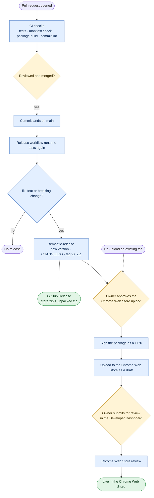

# Releasing

This covers the browser extension. The iOS app's TestFlight and App Store steps are in [APP_STORE.md](APP_STORE.md).

Releases are automated with [semantic-release](https://semantic-release.gitbook.io/), driven by
[Conventional Commits](https://www.conventionalcommits.org/) on `main`. The workflow is
`.github/workflows/release.yml` and the config is `voucherboard/release.config.cjs`.

## From pull request to the Chrome Web Store



Yellow steps are done by the owner, blue ones are automatic, and green ones are where a release
ends up. Signing only happens when `CWS_VERIFIED_CRX` is `true`.

## How a release happens

1. A pull request runs CI (`ci.yml`) and commit lint (`commitlint.yml`).
2. When a commit lands on `main`, `release.yml` runs the tests, then `npx semantic-release` in
   `voucherboard/`, which:
   - works out from the commit messages since the last tag whether to release, and how big a bump;
   - updates `CHANGELOG.md`, and the version in `package.json` and the lockfile (nothing is
     published to npm);
   - runs `scripts/set-manifest-version.mjs`, which sets `manifest.json`'s `version` and
     `version_name`, then `npm run package`, which builds `dist/voucherboard-<version>.zip` (for the
     store) and `dist/voucherboard-<version>-unpacked.zip` (for Load unpacked);
   - commits those files as `chore(release): <version> [skip ci]` and tags `v<version>`;
   - creates a GitHub Release with both zips.
3. The `chrome-web-store` job uploads the store package as a draft, once the owner approves it.
4. The owner submits the draft for review in the Developer Dashboard. CI never submits.

## Commit types and version bumps

The commit analyser uses the Angular preset (semantic-release's default):

| Commit prefix | Bump |
| --- | --- |
| `fix:` | patch |
| `feat:` | minor |
| any type with a `BREAKING CHANGE:` footer, or `!` after the type (`feat!:`) | major |
| `docs:`, `chore:`, `refactor:`, `style:`, `test:`, `ci:`, `build:` | none |
| `perf:` | patch |

Commit messages are checked on every push and pull request, so a malformed type fails CI instead
of silently not releasing. To check locally, run `npm run commitlint`.

## `version_name` while in beta

`scripts/set-manifest-version.mjs` sets `version_name` to `"<version> beta"` while the extension
is pre-1.0. For the 1.0.0 release, change the script to drop the suffix.

## Chrome Web Store uploads

The `chrome-web-store` job uses the
[Chrome Web Store API v2](https://developer.chrome.com/docs/webstore/using-api):

1. Downloads the store zip the `release` job built and tested.
2. If `CWS_VERIFIED_CRX` is `true`, signs it as a CRX with Chrome (`--pack-extension`).
3. Gets a short-lived Google access token through Workload Identity Federation.
4. Uploads the package, waits until the upload has been processed, and fails unless it succeeded.

If the settings below aren't configured, the job posts a notice and skips.

| Name | Kind | Value |
| --- | --- | --- |
| `CWS_PUBLISHER_ID` | variable | Developer Dashboard → Account |
| `CWS_EXTENSION_ID` | variable | `cldhejnblckejbeebjidikhebdfnncak` |
| `GCP_WIF_PROVIDER` | variable | The Workload Identity Federation provider's resource name |
| `CWS_SERVICE_ACCOUNT` | variable | The service account's email, also added in Developer Dashboard → Account |
| `CWS_VERIFIED_CRX` | variable | `true` to sign and upload a CRX; unset uploads the zip |
| `CWS_CRX_KEY` | secret | The CRX signing key, needed only when `CWS_VERIFIED_CRX` is `true` |

### Re-uploading an existing release

To retry the upload without cutting a new version, run the release workflow on `main` with a tag:

```sh
gh workflow run release.yml --ref main -f cws_tag=v0.2.1
```

This skips semantic-release and uploads that tag's store zip from its GitHub Release. The store
only accepts a version higher than the one it has published. A failed run can also be re-run
from the Actions UI.
