# Voucherboard guide

Voucherboard is a **beta** browser extension that adds a clearer visitor-voucher planner on top of
Lewisham Council's parking permit site. It's an independent tool: it isn't made, endorsed, supported or
checked by Lewisham Council. It runs in your own logged-in browser tab and makes the same requests the
council's own pages make. You use it entirely at your own risk — see [Terms and conditions](#terms).

## Install

Voucherboard isn't published to the Chrome Web Store yet. Until then, load it unpacked:

1. Download or clone the repository.
2. Open `chrome://extensions`, and turn on **Developer mode**.
3. Choose **Load unpacked**, and select the `voucherboard` folder.
4. Open `https://parkingpermits.lewisham.gov.uk` and sign in as you normally would.

Once Voucherboard is on the Chrome Web Store, this section will describe installing it from there
instead.

## First run and terms

On a page of the council's site, a **Voucherboard Beta** button appears in the bottom-right corner.

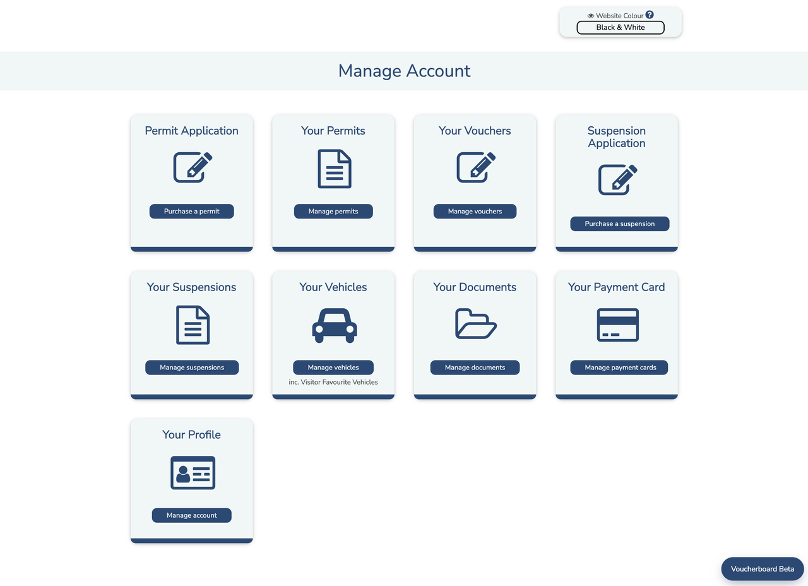

The first time you open it, Voucherboard shows its terms and conditions. Nothing is read from the
council site before you accept them. Tick **I have read and accept these terms, and I understand that I
use Voucherboard entirely at my own risk**, then choose **Accept and continue**. Choosing **Don't
accept** closes Voucherboard.

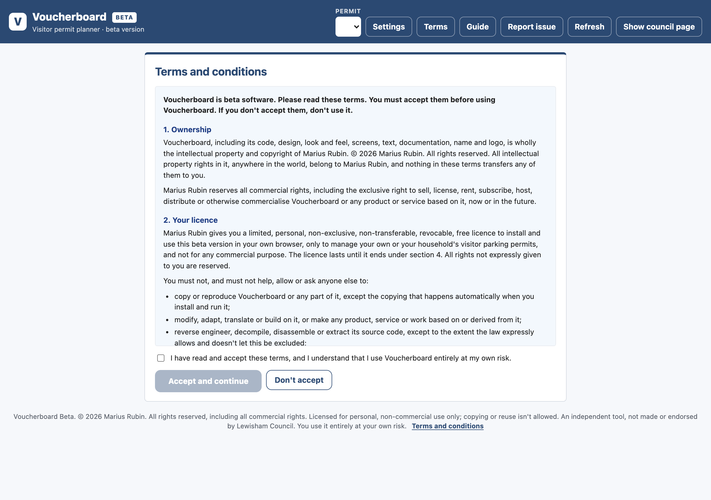

You're asked again whenever the terms change.

## The planner, at a glance

The top panel has a **Permit** picker (if you hold more than one), **Settings**, **Terms**, **Guide**,
**Report issue**, **Refresh** and **Show council page**. Below it, the zone card shows your permit's
zone and controlled hours, and your unused voucher balance.

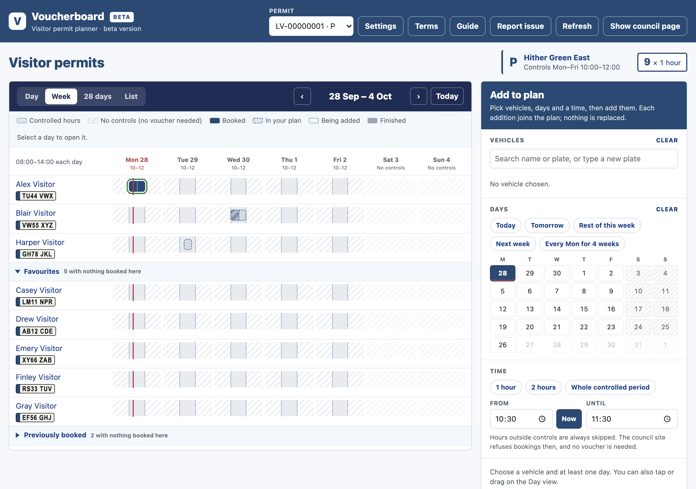

The board has four views, as tabs: **Day**, **Week**, **28 days** and **List**. Each vehicle gets a row,
with controlled hours shaded, bookings shown solid, and anything in your plan shown dashed.

**Day** view shows one day in detail, with hour labels and a line for the current time:

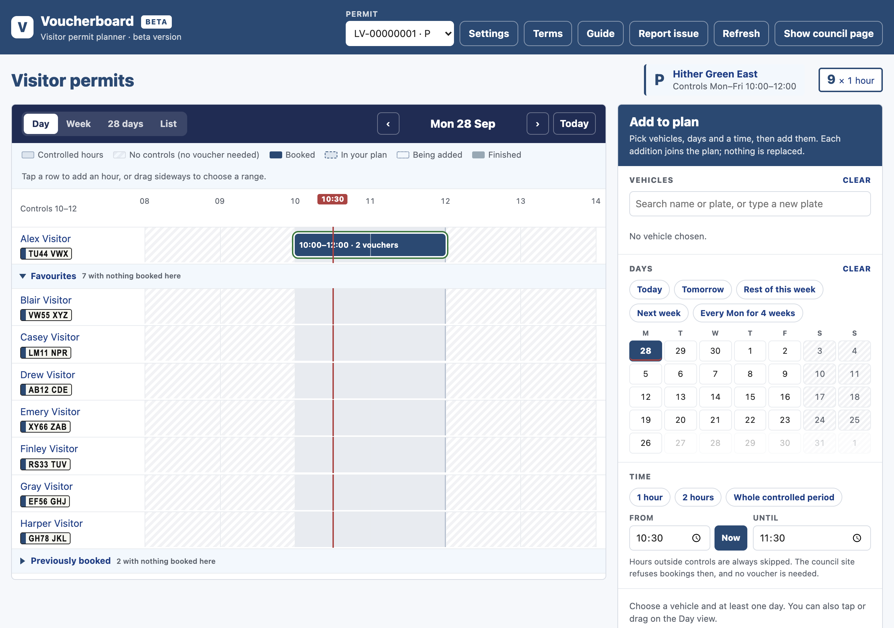

**List** view shows every booking and planned change as rows, filterable by vehicle:

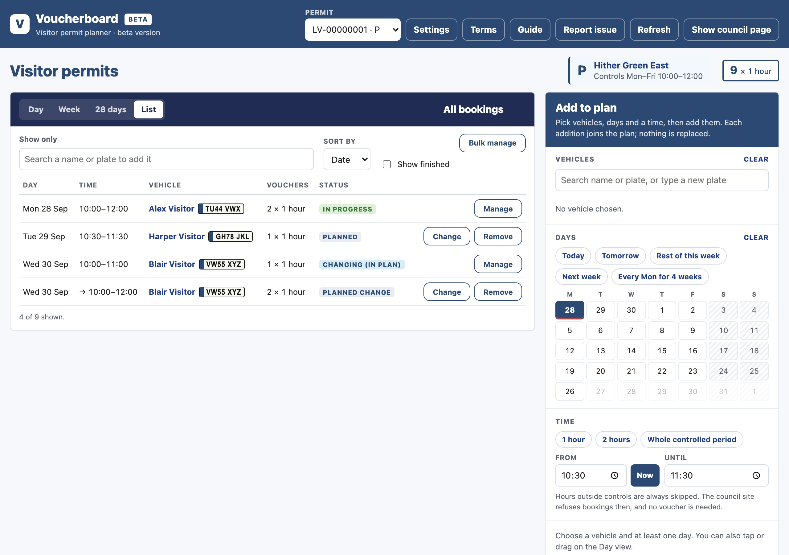

On the right, the **composer** ("Add to plan") is where you build a plan: pick vehicles, days and a
time, add them, then review and book everything together. Nothing is sent to the council site until you
review your plan and press the button to run it.

On a phone-sized screen, the board and composer stack into one column, and a bar at the bottom shows
what's planned and a **Review** button:

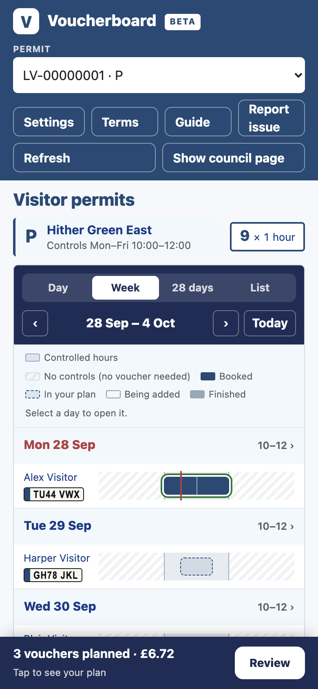
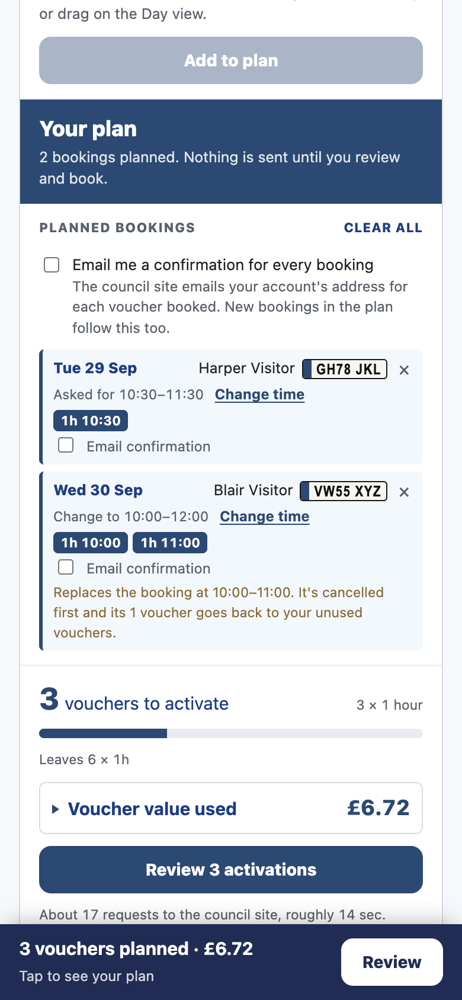

## Book a visitor

1. In **Vehicles**, search by name or plate, or type a new plate. Suggestions show your favourites
   first.

   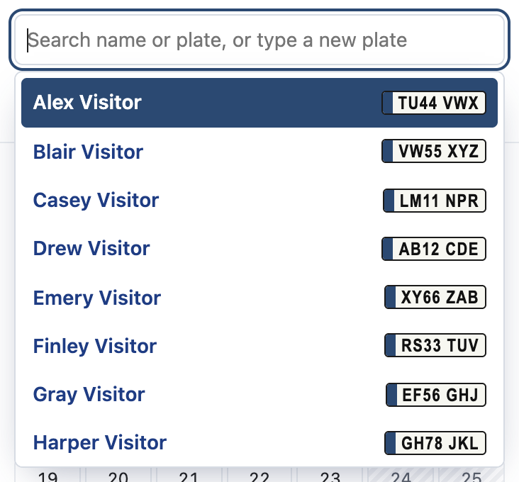

   Typing a plate that isn't a favourite offers **New vehicle**. Turn on **Save vehicle as favourite**
   to save it to your council account with the first booking, and give it a nickname.

   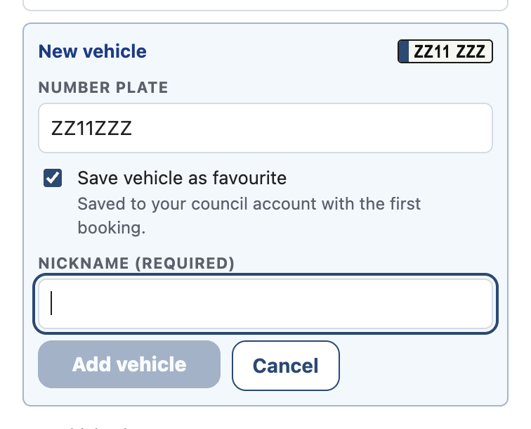

2. In **Days**, tap dates on the mini calendar, or use a quick button (**Today**, **Tomorrow**, **Rest
   of this week**, **Next week**, or **Every `<day>` for 4 weeks**).

   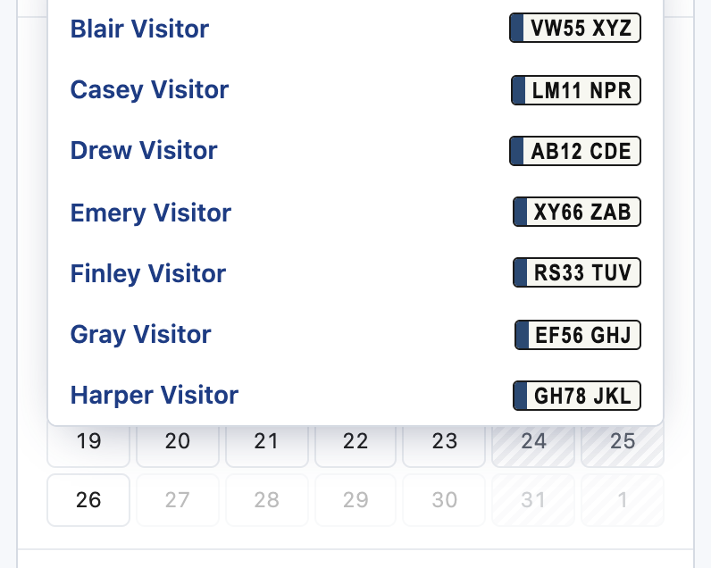

3. In **Time**, use a quick button (**1 hour**, **2 hours**, **5 hours** where the zone allows it, or
   **Whole controlled period**), or set **From** and **Until** yourself. **Now** starts the booking
   immediately, today. Hours outside controlled hours are always skipped — the council site refuses
   bookings then, and no voucher is needed.

   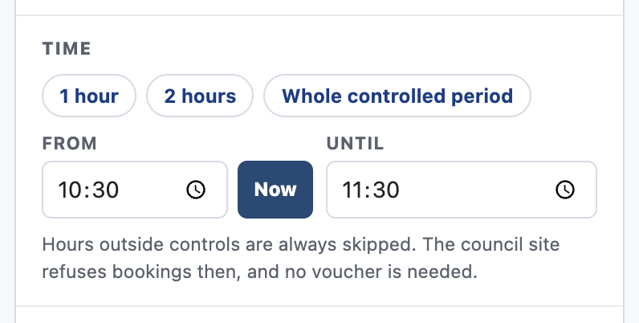

4. Choose **Add to plan**. The booking joins your plan; nothing already there is replaced.

   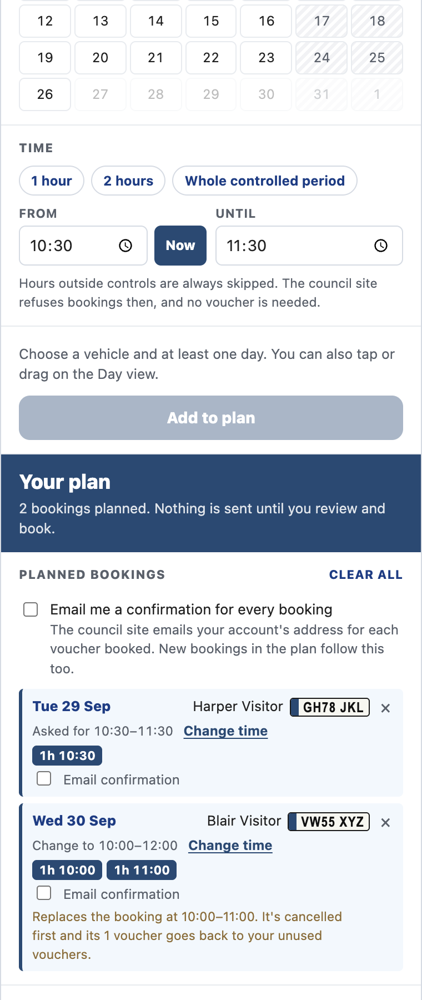

5. When your plan is ready, choose **Review N activation(s)**, check the plates and times, then press
   the button to run it (see [Settings and test mode](#settings-and-test-mode) for what that button
   says and does).

You can also tap or drag directly on the **Day** board to add a booking.

## Book several at once

Add more than one vehicle, day or booking to the plan before reviewing: each addition joins the plan,
so you can build up a whole week's bookings and send them together. If your plan needs more vouchers
than you hold, or a cheaper mix of voucher lengths would cover it, Voucherboard shows purchase advice
under the plan summary:

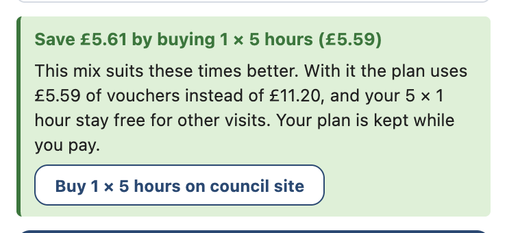

Choosing **Buy N × `<length>` on council site** takes you to the council's own Buy Again
dialog with the period and number already filled in — see [Buy more vouchers](#buy-more-vouchers).

When you review the plan, every booking and cancellation is sent to the council site one at a time, in
order, so it looks like someone clicking through the site. Expect roughly half a second between
requests.

## Change or cancel a booking

Tap a booked block on the board, or choose **Manage** on it in List view, to open its popover.

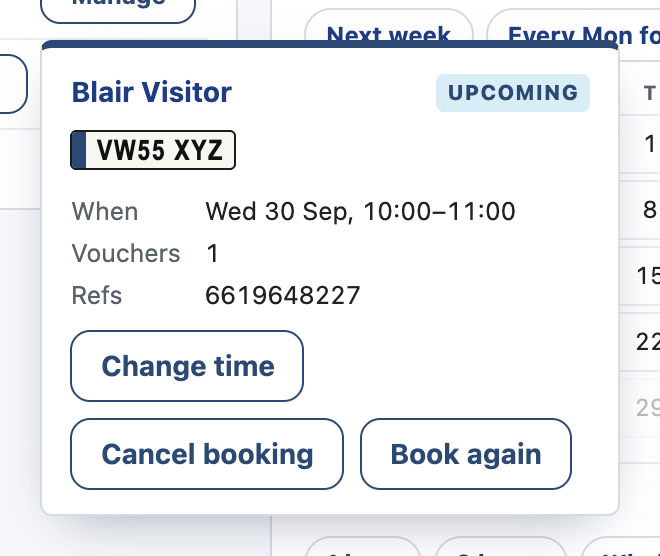

- **Cancel booking** asks you to confirm, since it's destructive. Its vouchers go back to your unused
  vouchers once you confirm.

  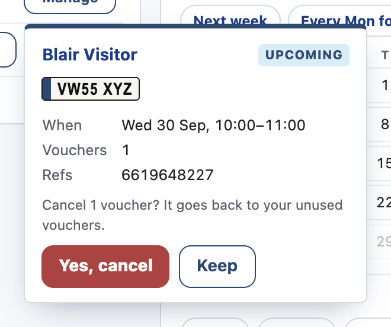

- **Change time** adds the change to your plan as a cancel-and-rebook: the old booking is cancelled just
  before the new time is booked, when you review the plan.

  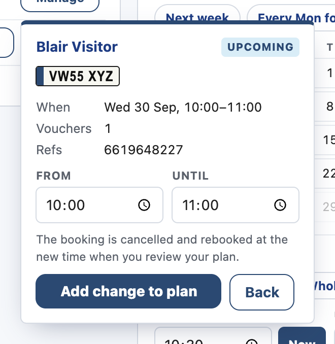

- **Book again** pre-fills the composer with the same vehicle and time, so you can pick new days.

In **List** view, choose **Bulk manage** to change or cancel several bookings and planned items
together: tick the ones you want (only planned items and bookings the council site allows cancelling can
be selected), then **Change time** or **Cancel**.

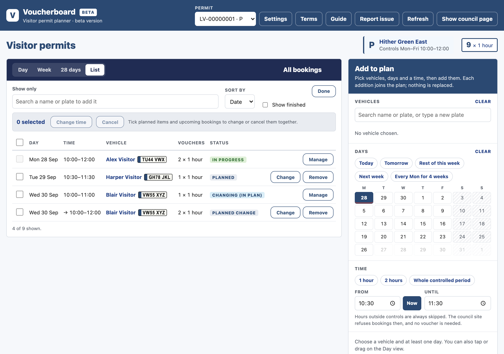
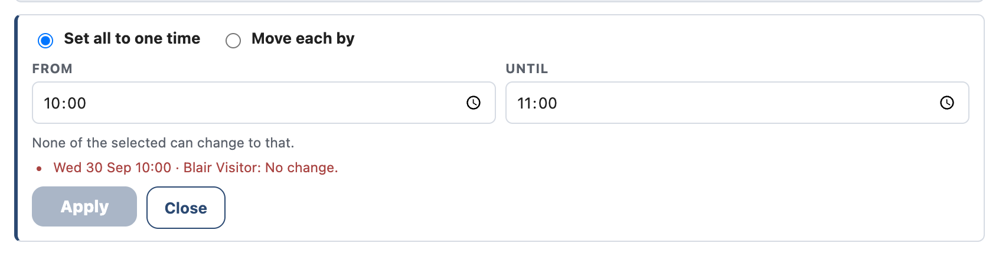

## End a booking early (beta)

This beta feature lets you end a booking that's already started, by cancelling the vouchers in it that
haven't started yet. Turn on **Beta: end bookings in progress early** in [Settings](#settings-and-test-mode)
first.

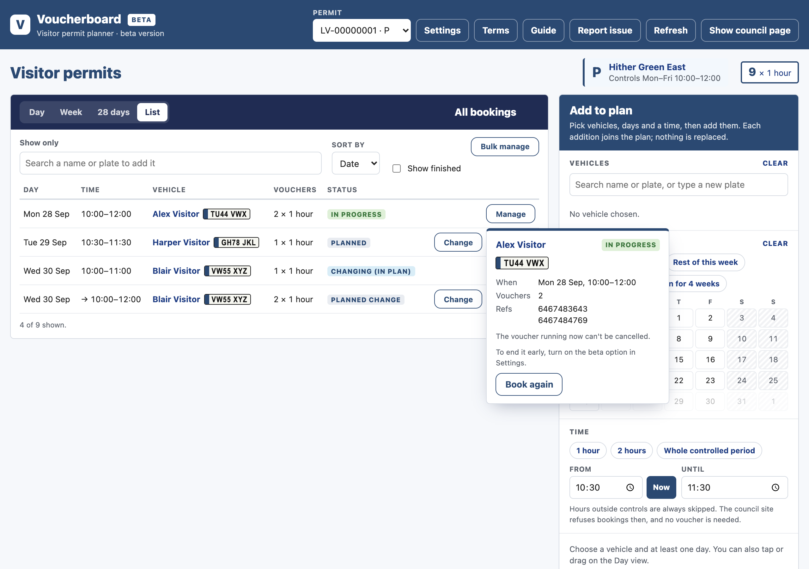

Its popover then offers **End early**: choose when it should end, from the voucher boundaries available,
and confirm. The voucher running now can never be cancelled, so it can only end when a voucher ends.

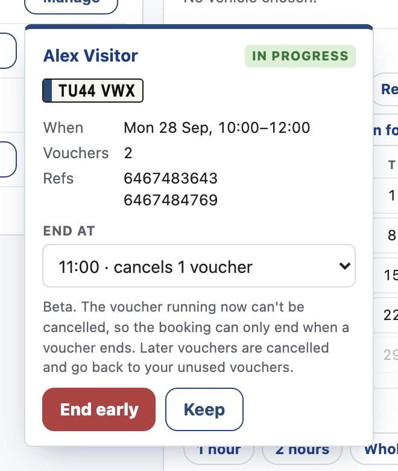

## Manage favourites

Choose a vehicle's name (not its plate) to open its popover.

- On a favourite, choose **Delete favourite**, then confirm. This only removes it from your council
  account's favourites; bookings already made aren't affected.

  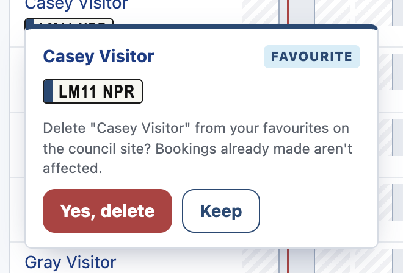

- On a vehicle that isn't a favourite yet, give it a nickname and choose **Save as favourite** to save
  it to your council account straight away, rather than waiting for its next booking.

  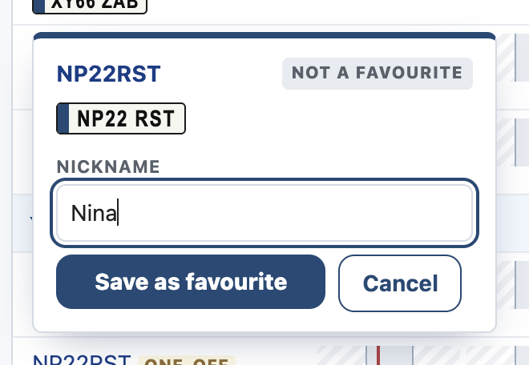

## Buy more vouchers

Voucherboard never buys vouchers for you. When you choose a **Buy** button (from purchase advice, or
when a plan needs more vouchers than you hold), it checks the council site allows that many, then takes
you to the council's own permits page and opens its **Buy Again** dialog for you, with the voucher
length and number already filled in.

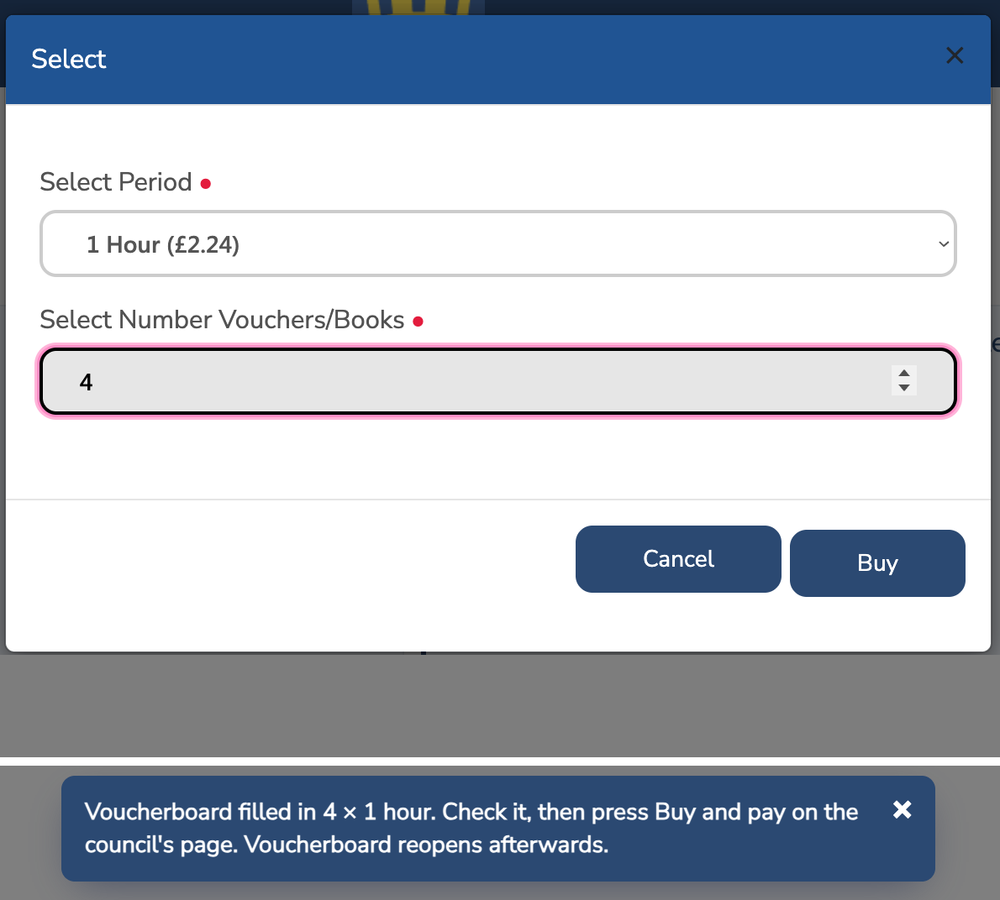

Check it, then press **Buy** and pay on the council's own page yourself — Voucherboard never runs on a
payment page. It reopens automatically afterwards.

## Settings and test mode

Choose **Settings** in the top panel.

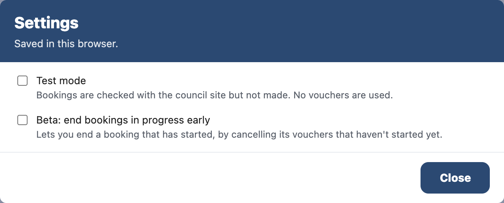

- **Test mode** checks every booking with the council site the same way a real one would, but doesn't
  book it and doesn't use a voucher. Voucherboard starts in **live** mode; turn test mode on while
  you're learning how it works. When it's on, a **Test mode** tag shows next to **Beta** in the top
  panel.

  

- **Beta: end bookings in progress early** turns on the feature described
  [above](#end-a-booking-early-beta).

Both are saved in this browser only.

### Reviewing and running a plan

The review screen looks slightly different in each mode. In test mode, the button reads **Run test**,
and a note explains that nothing will be booked or use a voucher:

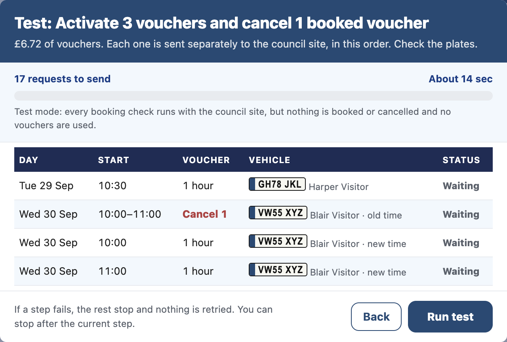

Once you start it, a progress bar tracks each request:

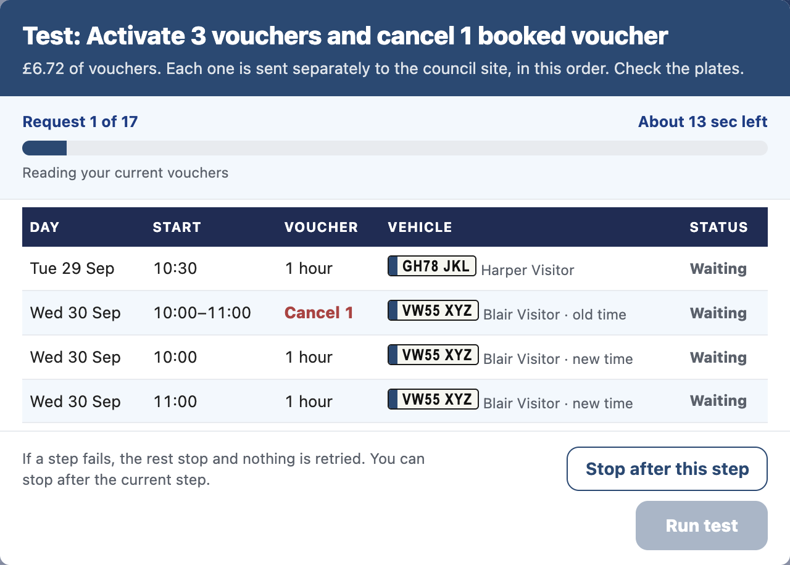

Test mode finishes with a pass/fail summary and books nothing:

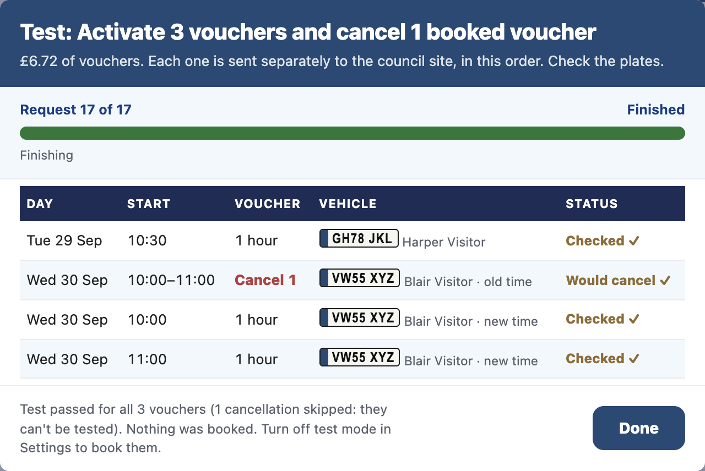

In live mode, the button reads **Book N voucher(s)** (and **cancel N**, where the plan includes
changes), and it books and cancels for real. If a step fails, the run stops there — nothing after it is
sent, and it stays in your plan to try again. Choose **Copy error details** to copy a plain-text report
(with anti-forgery tokens removed) for a bug report.

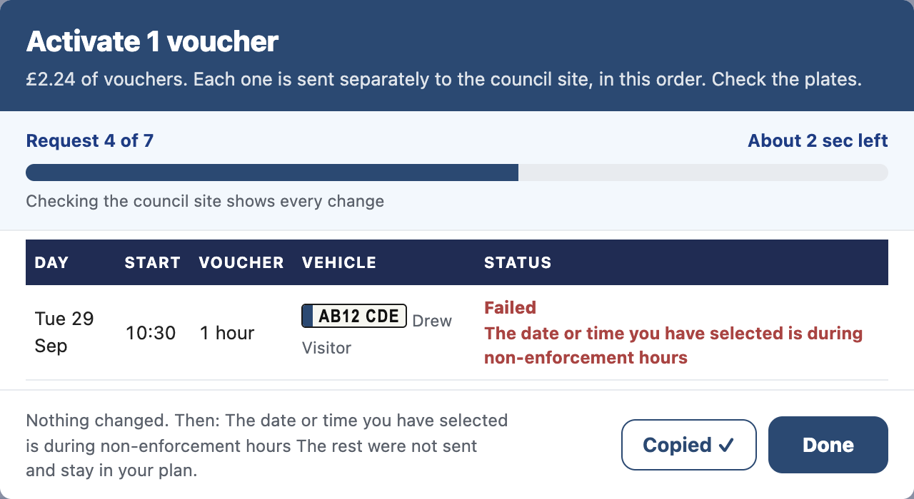

You can also open **Terms** at any time from the top panel or the footer, to re-read them without
starting over:

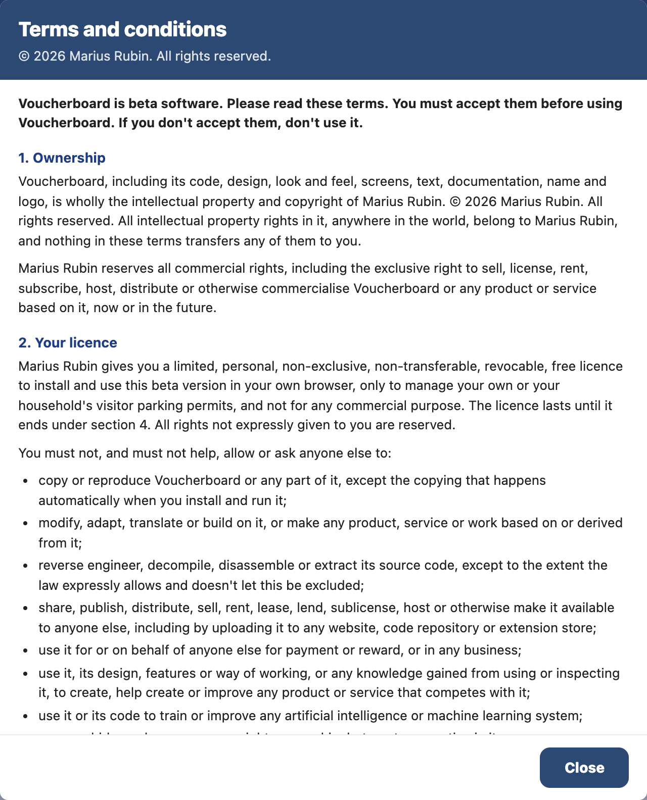

## Zone hours

Controlled hours vary by zone. Voucherboard finds your zone from your permit and shows its hours on the
zone card. Zone P (Hither Green East), for example, is controlled Monday to Friday, 10:00–12:00. Bookings
outside controlled hours are always skipped, since the council site doesn't need or allow a voucher
then. On bank holidays, check street signs — Voucherboard shows the bank holiday's name on the board,
but doesn't know whether your zone is enforced that day.

## What Voucherboard never does

- It never runs on, or scripts, payment, buy, account or card pages.
- It never makes a request to anything other than the council's own site.
- It never buys anything for you: you always press **Buy** and pay on the council's own page yourself.
- It never reads, stores or sends your password or card details.
- Destructive actions — cancelling a booking, deleting a favourite, ending a booking early — always ask
  you to confirm first.

## Troubleshooting

**I have more vouchers than expected.** A few things return vouchers or don't use them: cancelling a
booking returns its vouchers to your unused balance; test mode never uses a voucher, however many runs
you try; and a run that fails partway through stops immediately, so anything not yet sent is never
booked and never uses a voucher.

**A booking looks different on the council site than in Voucherboard.** Voucherboard reads your
bookings and vouchers fresh from the council site each time it opens, or when you choose **Refresh**.
The council site's own Active permits list is the final word on what's booked.

**Voucherboard says it can't reach the council site, or that I've been logged out.** Sign in again on
the council's site, then reopen Voucherboard.

**The Buy Again dialog didn't fill in, or Voucherboard couldn't find the Buy Again button.** Use **Buy
Again** on your permit yourself, and choose the voucher length and number Voucherboard told you to.

## Reporting an issue

Choose **Report issue** in the top panel. It opens the project's GitHub issues page in a new tab. If
you've just had a failed run, choose **Copy error details** first and paste it into the issue — it's
plain text, with anti-forgery tokens already removed.

## Terms

See the terms in the extension itself: choose **Terms** in the top panel, or **Terms and conditions** in
its footer. You must accept them before Voucherboard reads anything from the council site, and you're
asked again whenever they change.
